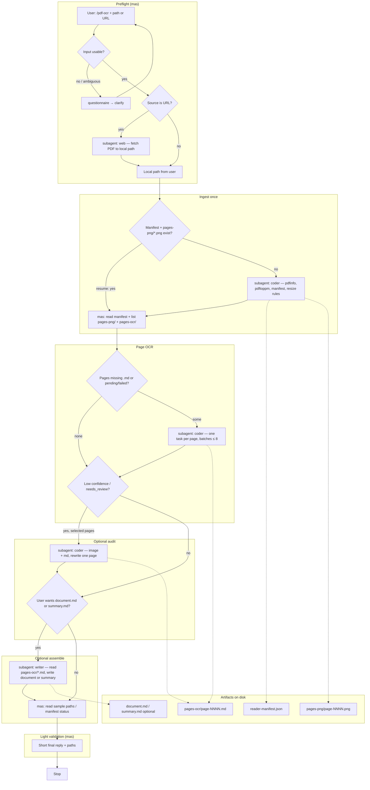

# `/pdf-ocr` workflow (mas)

The diagram and pseudocode below describe the **intended** `/pdf-ocr` prompt flow for the `mas` orchestrator: `reader-manifest.json` plus split trees **`pages-png/`** (renders) and **`pages-ocr/`** (markdown), with **delegation targets** the durable top-level agents (`coder`, `web`, `writer`, `ask`) instead of reader’s `ingester` / `ocr-page` / etc.

## Flow (Mermaid)



**Legend:** Rectangles are steps **mas** runs with its own tools (`read`, `ls`, …). Rounded nodes are decisions. `subagent: …` steps are **one** `subagent` call per box (OCR box may fan out to parallel tasks inside that call, same idea as reader’s batches of 8).

## Pseudocode

```text
INPUT: user_text  # from $@ ; may be file path, URL, or path + options (e.g. "assemble document")

FUNCTION mas_pdf_ocr(user_text):
  # --- Preflight ---
  topic, path_or_url ← parse_preflight(user_text)
  IF topic ambiguous AND no usable path/URL:
    RETURN questionnaire("Need a PDF file path or HTTPS URL …")

  pdf_path ← null
  IF path_or_url is HTTP(S)_URL:
    pdf_path ← subagent("web", task: download to agreed local path, return path)
    IF download failed: RETURN blocker
  ELSE:
    pdf_path ← resolved_local_path(path_or_url)

  # pages-png/ + pages-ocr/ + manifest are created by the ingest subagent on first run

  # --- Resume vs fresh ingest ---
  IF file_exists("reader-manifest.json") AND glob("pages-png/*.png").non_empty:
    manifest ← read("reader-manifest.json")
    IF user did NOT request re-ingest:
      GOTO ocr_phase
  # else fall through to ingest

  # --- Ingest (once) ---
  reply_ingest ← subagent("coder", task:
    run pdfinfo / pdftoppm (or magick fallback),
    apply DPI + max-edge rules,
    write reader-manifest.json,
    emit pages-png/page-0001.png …,
    return confirmation + page count + blockers)
  IF reply_ingest indicates hard failure:
    RETURN blocker

ocr_phase:
  pending_pages ← pages_from_manifest_missing_md_or_pending()

  WHILE pending_pages.non_empty:
    batch ← next_up_to(pending_pages, 8)
    subagent("coder", parallel_tasks: one OCR contract per page in batch)
      # each task: single PNG in, single MD out, frontmatter per reader ocr-page style
    pending_pages ← pages_from_manifest_missing_md_or_pending()

  # --- Optional page audit ---
  flagged ← pages_where_worker_reported_low_confidence_or_needs_review()
  FOR EACH page IN flagged:   # or batched similarly
    subagent("coder", task: read PNG + existing MD, fix transcription, write same MD path)

  # --- Optional document-level output ---
  IF user asked for full transcript OR summary:
    subagent("writer", task: read all pages-ocr/*.md, write document.md and/or summary.md)

  # --- Orchestrator-only checks (no path-only ask) ---
  skim manifest + spot-check a few MD paths with read()
  RETURN short_message(paths: reader-manifest.json, pages-png/, pages-ocr/, document.md if any)
```

## Worker mapping (reference)

| Reader MAS role | Planned mas delegate | Why |
|-----------------|----------------------|-----|
| Fetch remote PDF | `web` (or `coder` + `curl`) | URL acquisition |
| `ingester` | `coder` | `bash` + Poppler/ImageMagick + writing manifest |
| `ocr-page` | `coder` | `read` image, `write` one `.md` per page; needs **vision-capable** model on that worker |
| `page-auditor` | `coder` | Same tools; one page per task |
| `assembler` | `writer` | Prose / stitched doc from existing markdown; no `bash` required |
| PASS/FAIL rubric over pasted excerpts | `ask` | Only with **inline** text; never “read `pages-ocr/foo.md`” |

Adjust the diagram if you later pin OCR to `writer` (multimodal + `write`) or split fetch strictly onto `web` vs `coder`.
