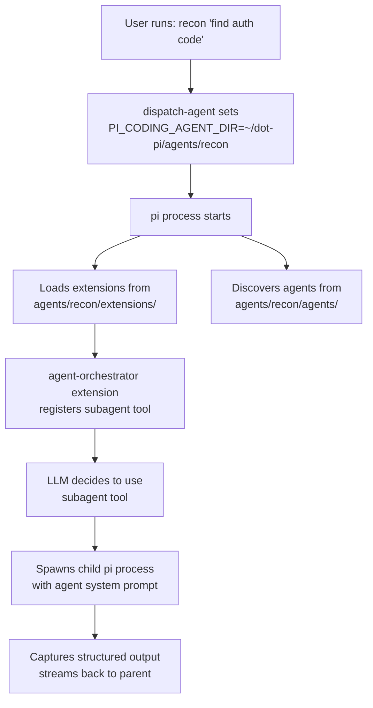
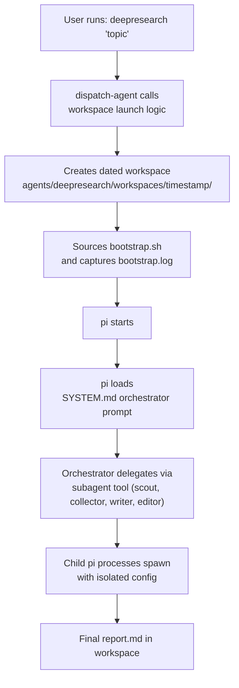
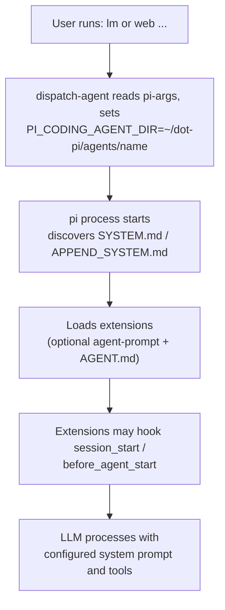

# Architecture

## The PI_CODING_AGENT_DIR Mechanism

pi resolves its config root via `getAgentDir()` in the coding-agent package. This function checks the `PI_CODING_AGENT_DIR` environment variable first. When set, **all** of pi's configuration loads from that directory instead of `~/.pi/agent/`:

- `extensions/` -- auto-discovered TypeScript extensions
- `agents/` -- subagent config directories for MAS configs
- `prompts/` -- prompt template files
- `skills/` -- skill definitions (SKILL.md files)
- `bin/` -- downloaded tool binaries (fd, rg)
- `sessions/` -- conversation history
- `settings.json` -- pi settings
- `models.json` -- custom model providers
- `auth.json` -- API authentication
- `SYSTEM.md` / `APPEND_SYSTEM.md` -- system prompts for standalone agents and MAS orchestrators
- `bootstrap.sh` -- sourced launch setup; `WORKSPACE_AGENT=1` triggers workspace mode in dispatch-agent

This is the mechanism dot-pi exploits for both MAS and standalone agent configurations.

For the user-facing command syntax implemented by `dispatch-agent`, see [Terminal Dispatch](terminal-dispatch.md). The launcher itself is intentionally thin: it resolves `DOT_PI_DIR`, sources focused modules from `core/dispatch/` in a fixed order, then calls the main dispatch function.

## Directory Layout

```
dot-pi/
├── dotpi                     # CLI: setup, create, create-agent, list, link-skill, link-auth
├── dispatch-agent            # Symlink target in core/bin/ (dispatches commands to agents)
├── core/                     # Implementation internals
│   ├── commands/             # Subcommand scripts (sourced by dotpi)
│   ├── dispatch/             # Sourced launcher modules
│   ├── bin/                  # Command symlinks (generated by dotpi sync)
│   └── tests/                # TypeScript typecheck harness
├── AGENTS.md                 # LLM-readable project guide
├── shared/                   # Reusable resources (never loaded directly)
│   ├── extensions/           # Shared extension source code
│   ├── skills/               # Shared skill definitions (SKILL.md files)
│   ├── themes/               # Shared themes (JSON)
│   ├── bin/                  # Downloaded binaries (fd, rg) -- gitignored contents
│   ├── models.json           # Custom model provider config (symlink)
│   └── auth.json             # API credentials (gitignored local file)
├── agents/                   # MAS and standalone agent directories
│   └── <name>/               # Each is a complete PI_CODING_AGENT_DIR root
│       ├── extensions/       # Custom extension (+ shared symlinks)
│       ├── agents/           # Optional subagent config directories
│       ├── prompts/          # Prompt templates (slash-command workflows)
│       ├── skills/           # ← individual symlinks to shared/skills/
│       ├── themes/           # ← individual symlinks to shared/themes/
│       ├── SYSTEM.md         # Standalone prompt or MAS orchestrator prompt
│       ├── banner.txt        # Startup branding (ASCII art + usage)
│       ├── bin/              # ← symlink to shared/bin/
│       ├── sessions/         # Runtime (gitignored)
│       ├── models.json       # ← symlink to shared/models.json
│       └── auth.json         # ← symlink to shared/auth.json
├── docs/                     # This documentation (MkDocs)
└── references/               # Reference submodules
    ├── pi-mono/              # Read-only upstream pi source
    └── qmd/                  # Additional reference (see .gitmodules)
```

## Data Flow



### Workspace MAS Flow



### Standalone Agent Flow



See [Standalone Agents](standalone-agents.md) for details.

## MAS Configuration

### `SYSTEM.md` -- Orchestrator Prompt

In a MAS config, `SYSTEM.md` is the parent orchestrator's system prompt. It should describe when to delegate, which artifacts subagents should produce, and how the final answer should be synthesized.

```yaml
# Deep Research Orchestrator

You are the orchestrator for a deep research workflow...
```

## Extension Architecture

The `agent-orchestrator` extension extends the upstream `subagent` example with directory-based subagent discovery, usage contracts, session capture, and provider-derived scheduling:

### Agent Discovery

Subagents are pi config directories discovered from `<agentDir>/agents/` and project-local `.pi/agents/`. A subagent is available when its directory contains `SYSTEM.md` or `APPEND_SYSTEM.md`. Optional `USAGE.md` files document invocation contracts that are appended to the orchestrator prompt.

### Execution Modes

| Mode | Input | Behavior |
|------|-------|----------|
| **Single** | `{ agent, task }` | One agent runs one task |
| **Parallel** | `{ tasks: [...] }` | Independent tasks scheduled from resolved model providers |
| **Chain** | `{ chain: [...] }` | Sequential pipeline; `{previous}` passes output forward |

### Prompt Templates

Prompt templates (`.md` files in `prompts/`) define reusable workflows. They can reference `$@` as a placeholder for user input and are invoked with `/template-name` syntax in the pi chat.

## Isolation Model

Each agent directory is a complete pi config root. This provides:

- **Extension isolation** -- each agent config loads only its own extensions
- **Agent isolation** -- each MAS exposes only its linked subagents to the orchestrator
- **Skill isolation** -- per-agent config via individual symlinks, per-subagent via frontmatter (`skills`, `no-skills`)
- **Session isolation** -- separate conversation history per agent config
- **Settings isolation** -- per-agent config model preferences and configuration

Shared resources (extensions, themes, models, binaries, **auth**) are symlinked from `shared/` when you scaffold an agent config. **Skills are opt-in:** link them with `dotpi link-skill` (or `ln -sf`) into `skills/`. Downloaded binaries (`fd`, `rg`) are written once to `shared/bin/` through directory symlinks and shared across all agent configs automatically. API credentials live in **`shared/auth.json`**; `dotpi sync` links each top-level `agents/<name>/auth.json` to that file (same pattern as `models.json` / `settings.json`). Use **`dotpi link-auth`** only when an agent must use a different credential file. Subagents can further tune their own tools, skills, and model choices through their own config roots.
