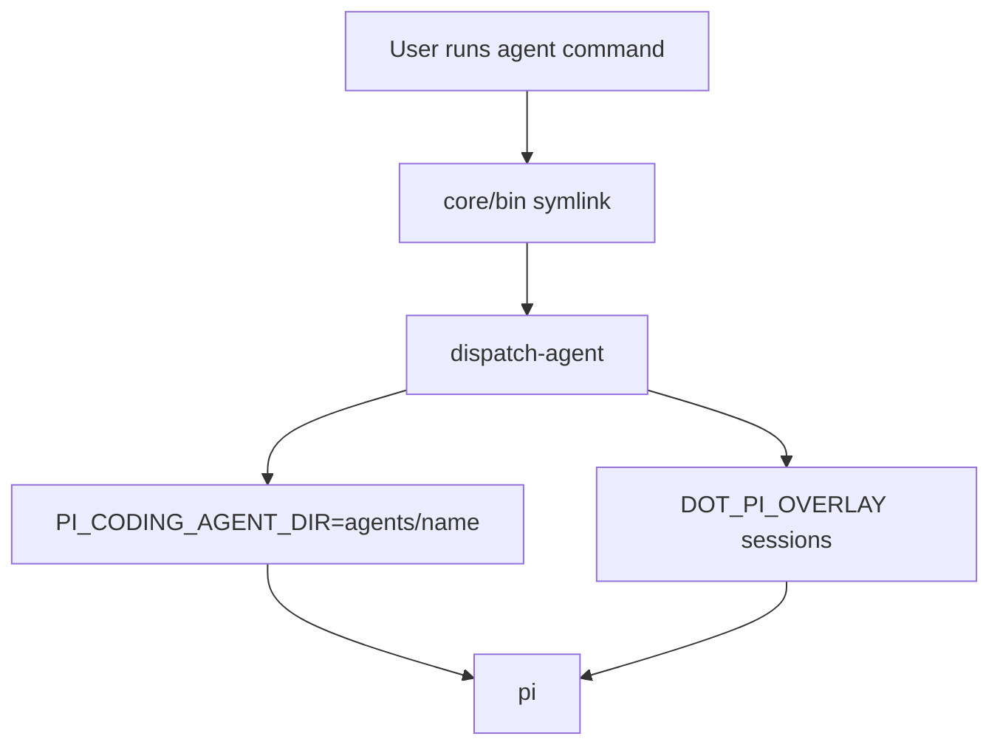
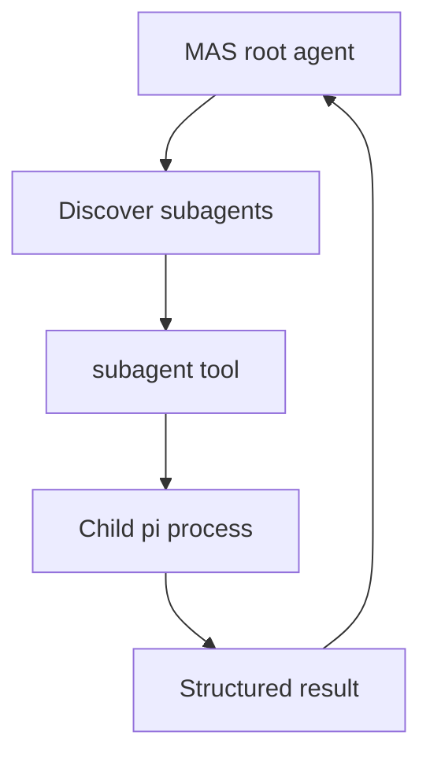

# Architecture

## Install Model

dot-pi is a Pi git package. Users install it with:

```bash
pi install git:https://github.com/PlebeiusGaragicus/dot-pi
```

Pi records the package in vanilla `~/.pi/agent/settings.json` and owns the clone under `~/.pi/agent/git/...`. The package root has an inert Pi manifest, so vanilla `pi` does not load dot-pi resources from the package root.

Named agents load from `agents/<name>/` inside the package clone through `dispatch-agent`.

## Runtime Isolation

`dispatch-agent` sets:

```text
PI_CODING_AGENT_DIR=<package-root>/agents/<name>
DOT_PI_DIR=<package-root>
DOT_PI_OVERLAY=${DOT_PI_OVERLAY:-$HOME/.pi/dot-pi}
```

It also passes `--session-dir` under the overlay so session history survives `pi update`.

## Directory Layout

```text
dot-pi/
├── package.json              # inert Pi manifest plus postinstall
├── dotpi                     # management CLI
├── dispatch-agent            # symlink target in core/bin
├── core/
│   ├── bin/                  # command symlinks
│   ├── commands/             # dotpi subcommands
│   ├── dispatch/             # launch modules
│   ├── install/              # postinstall/relink helpers
│   └── tests/
├── agents/                   # top-level PI_CODING_AGENT_DIR roots (MAS + standalone + workers)
├── shared/                   # shared extensions, skills, prompts, themes
└── docs/
```

User-owned state:

```text
~/.pi/dot-pi/
├── settings.json
├── model-defaults
├── env.exa
├── env.tavily
├── env.ntfy
├── env.tts-wpm
└── <agent>/
    ├── sessions/
    ├── prompts/
    ├── skills/
    ├── extensions/
    └── themes/
```

## Dispatch Flow



All top-level agents run in-situ in the current working directory. Workspace mode has been removed.

## MAS Flow



Subagent configs are discovered from `agents/<mas>/agents/` and project-local `.pi/agents/`.

## Overlay Safety

`postinstall` and `dotpi relink` repair clone-local symlinks and create missing overlay directories. They must not overwrite existing overlay files. This is what makes `pi update` safe even though Pi may reset and clean the package clone.
