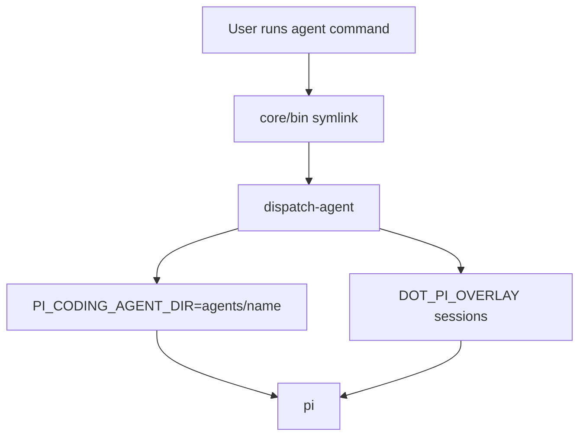
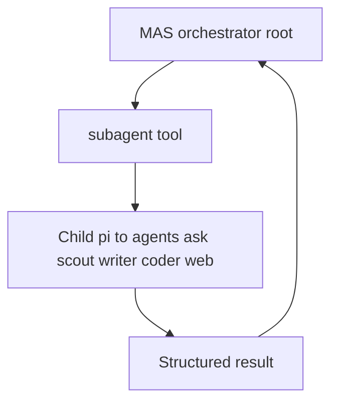

# Architecture

## Install Model

dot-pi is a Pi git package. Users install it with:

```bash
pi install git:https://github.com/PlebeiusGaragicus/dot-pi
```

Pi records the package in vanilla `~/.pi/agent/settings.json` and owns the clone under `~/.pi/agent/git/...`. The package root has an inert Pi manifest, so vanilla `pi` does not load dot-pi resources from the package root.

Named agents load from `agents/<name>/` inside the package clone through `dispatch-agent`.

### How `pi install` registers the package

`pi install <source>` materializes the package under the active agent directory (from `PI_CODING_AGENT_DIR` when set, otherwise `~/.pi/agent`) and appends the source string to `packages` in that directory’s `settings.json`. For the supported flow, leave `PI_CODING_AGENT_DIR` unset so registration lands in `~/.pi/agent/settings.json` and the clone lives under `~/.pi/agent/git/<host>/<path>/`. Pushes to the repo do not change the installed tree until the user runs `pi update`.

### Git clone lifecycle and `postinstall`

For git sources, Pi maintains the checkout under `{agentDir}/git/<host>/<path>/`. On update it may run `git reset --hard` and `git clean -fdx` in that clone. Untracked clone-local symlinks (for example into `$DOT_PI_OVERLAY`) are removed by `git clean`; **`core/install/postinstall.sh`** (triggered by `npm install` after install/update) and **`dotpi relink`** recreate them without overwriting existing overlay files.

### Nested dot-pi (do not)

Git packages install under the **active** agent directory. **`agents/<name>/settings.json` must not list the dot-pi package in `packages[]`**. If it did, Pi could install a second dot-pi clone under that agent’s tree (for example `agents/coder/git/...`), which is unsupported and confusing.

### Inert root manifest

Vanilla `pi` should stay behaviorally unchanged despite dot-pi being registered: the repo’s root **`package.json`** / **`pi`** manifest does not expose package-root extensions, skills, prompts, or themes to vanilla loading. Per-agent config and discovery live under **`agents/<name>/`** (symlinks into **`shared/`** and overlay-backed links), not in large inventory arrays in `settings.json`.

### Clone plus overlay (two layers)

Shipped layout lives in the Pi-managed clone under `agents/<agent>/{extensions,skills,prompts,themes}`. Durable user additions live under `$DOT_PI_OVERLAY/<agent>/…` (default `~/.pi/dot-pi/<agent>/…`). **`postinstall`** / **`dotpi relink`** wire overlay entries into the clone with symlinks so `PI_CODING_AGENT_DIR` stays a single tree for discovery. Discovery granularity matters: prompts and themes are typically individual symlinks; extensions are linked per extension; skills can be directory links—see [Agent layout](agent-layout.md).

### Alternative: dedicated `PI_CODING_AGENT_DIR` for install

You can install with `PI_CODING_AGENT_DIR` pointing at a separate directory so dot-pi never appears in `~/.pi/agent/settings.json`. That is more complex (updates and paths), so the documented product path is the default agent dir plus `pi install` / `pi update` as in [Installation](install.md).

## Runtime Isolation

`dispatch-agent` sets:

```text
PI_CODING_AGENT_DIR=<package-root>/agents/<name>
DOT_PI_DIR=<package-root>
DOT_PI_OVERLAY=${DOT_PI_OVERLAY:-$HOME/.pi/dot-pi}
```

It also passes `--session-dir` under the overlay so session history survives `pi update`.

## Directory Layout

```text
dot-pi/
├── package.json              # inert Pi manifest plus postinstall
├── dotpi                     # management CLI
├── dispatch-agent            # symlink target in core/bin
├── core/
│   ├── bin/                  # command symlinks
│   ├── commands/             # dotpi subcommands
│   ├── dispatch/             # launch modules
│   ├── install/              # postinstall/relink helpers
│   └── tests/
├── agents/                   # top-level PI_CODING_AGENT_DIR roots (MAS + standalone + workers)
├── shared/                   # shared extensions, skills, prompts, themes
└── docs/
```

User-owned state:

```text
~/.pi/dot-pi/
├── settings.json
├── model-defaults
├── env.exa
├── env.tavily
├── env.ntfy
├── env.tts-wpm
└── <agent>/
    ├── sessions/
    ├── prompts/
    ├── skills/
    ├── extensions/
    └── themes/
```

## Dispatch Flow



All top-level agents run in-situ in the current working directory. Workspace mode has been removed.

## MAS Flow



Shipped MAS uses **`top-level-agent-orchestrator`**: workers are fixed top-level **`agents/<worker>/`** configs (`ask`, `scout`, `writer`, `coder`, `web`), not a nested `agents/<mas>/agents/` pool. Project-local **`.pi/agents/`** may still be used for other pi workflows; see [Multi-agent systems](reference/multi-agent-systems.md).

## Overlay Safety

`postinstall` and `dotpi relink` repair clone-local symlinks and create missing overlay directories. They must not overwrite existing overlay files. This is what makes `pi update` safe even though Pi may reset and clean the package clone.
