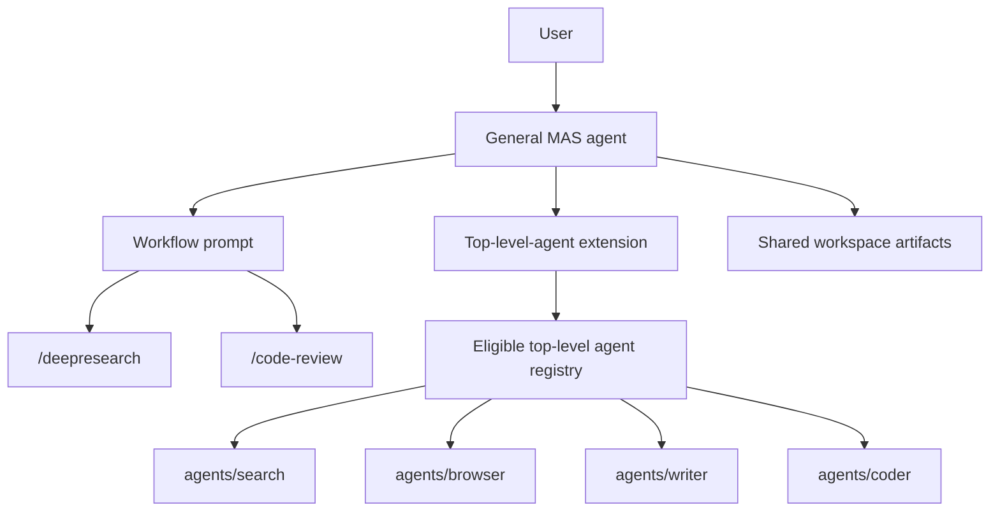

# Top-Level Agent MAS

This document specifies an experimental multi-agent system style for dot-pi. The goal is to reuse cleaned-up top-level agents as durable capability agents, then compose them with workflow prompts.

This is a design specification, not an implementation record. The existing MAS model remains valid and unchanged.

## Summary

The current MAS pattern gives each workflow-oriented agent its own nested worker pool. A deep research agent, for example, can have research-specific workers for scouting, collecting, writing, and editing. That shape is useful for tightly controlled workflows, but it can encourage duplicated worker definitions when several workflows need the same underlying capabilities.

The proposed pattern separates durable capability from workflow:

- Top-level agents represent durable capabilities and trust boundaries.
- Workflow prompts represent task-specific orchestration.
- A new extension discovers and invokes eligible top-level agents.
- The existing orchestrator extension remains responsible for the current nested-worker pattern.

In this model, a future general MAS agent could run a `/deepresearch` prompt that asks it to use a search-capable top-level agent, a browser-capable top-level agent, and a writing-capable top-level agent. The workflow prompt supplies the research-specific sequencing and artifact expectations. The workers remain general.

## Design Principle

Agents should represent durable capability and trust boundaries. Prompts should represent workflows.

A durable capability is something that remains useful across many workflows:

- Searching live web sources.
- Browsing and extracting page content.
- Writing and editing files.
- Reviewing code.
- Reading repository context.
- Performing OCR or vision-heavy inspection.

A workflow is a task pattern:

- Deep research.
- Documentation writing.
- Code review.
- Feature implementation.
- PDF reading.
- Release-note drafting.

The top-level-agent MAS should avoid creating new worker identities just because a workflow has a phase name. Instead of creating a permanent `scout` worker for one research workflow, the MAS should call a general search agent with precise instructions for the scouting phase. Instead of creating a permanent `report-writer` worker for one workflow, it should call a general writing agent with the report contract for that invocation.

Tool permissions, skills, model choices, context-file behavior, and safety posture must stay structural. They should not be moved into workflow prompts. A prompt can ask a worker to behave like a collector for one task, but it should not grant browser access, filesystem access, or repository context access.

## Relationship To Existing MAS

The existing MAS design should remain intact. It is optimized for agents that own their worker pool and invoke nested worker config roots. That pattern is still appropriate when a workflow needs stable, workflow-specific workers with strict contracts.

The top-level-agent MAS is a separate experiment:

- It uses a separate extension.
- It discovers a different class of worker.
- It has different compatibility rules.
- It should not alter existing nested-worker discovery.
- It should not require changes to current workflow-specific MAS agents.

This separation keeps the experiment reversible. If the new model proves useful, individual workflows can migrate later. If it does not, existing MAS behavior remains stable.

## Target Architecture



The MAS agent owns the user conversation. The workflow prompt tells the MAS how to decompose the task. The extension exposes eligible top-level agents as callable workers. Worker agents run in isolated child contexts and receive specific task instructions from the MAS.

## New Extension

The experiment should use a new extension, tentatively:

```text
shared/extensions/top-level-agent-orchestrator/
```

The new extension should not be a mode inside the existing orchestrator extension. It can borrow implementation ideas, but it should own its own discovery rules, tool schema, prompt augmentation, filtering, and compatibility checks.

Reasons to use a separate extension:

- It keeps existing MAS behavior stable.
- It avoids overloading one tool with two different meanings of "available agent."
- It lets the new model evolve independently.
- It makes the experiment easy to attach only to a future general MAS agent.
- It allows stricter eligibility checks for top-level agents.

The tool name should be distinct from the current nested-worker tool. A possible name is `agent`, `delegate`, or `top_agent`. The exact name should be chosen when implementation starts, but it should make clear that it invokes top-level capability agents, not nested workflow workers.

## Discovery Model

The extension should discover top-level agent config roots under:

```text
agents/
```

Discovery should be explicit and conservative. The extension should not blindly expose every top-level agent. A future MAS should have an allowlist, for example:

```json
{
  "agents": ["search", "writer", "coder", "ask"]
}
```

Only allowlisted agents should appear in the MAS catalog. This avoids accidental recursion and prevents partially cleaned-up agents from being invoked as workers.

The extension should exclude:

- The active MAS agent itself.
- Any agent marked as a workspace agent.
- Any agent that is itself an orchestration agent, unless explicitly allowed for a later advanced use case.
- Any agent without a capability descriptor.
- Any agent whose config is missing a system prompt.

Name collisions should be resolved before runtime. If two eligible agents expose the same callable name, startup should fail or the duplicate should be omitted with a clear diagnostic.

## Workspace Agent Exclusion

Workspace agents should be excluded from the first version.

Top-level agents normally launch through the dot-pi dispatcher. The dispatcher handles workspace selection, workspace creation, bootstrap sourcing, runtime environment setup, and resume behavior.

A worker invocation from a MAS extension starts a child agent process directly. It does not run the target agent through the dispatcher. That means a workspace agent's launch lifecycle is not available to the child process.

An agent should be considered incompatible when its bootstrap declares workspace mode:

```sh
WORKSPACE_AGENT=1
```

Later versions could define a way to delegate through the dispatcher or emulate the workspace lifecycle, but that should not be part of the first implementation.

## Capability Descriptors

Top-level agents need a parent-facing contract. The existing human-facing launcher docs are not part of this design.

The proposed descriptor file is:

```text
CAPABILITY.md
```

An eligible top-level agent should include this file. The new extension should use it to build the MAS catalog appended to the parent prompt.

The descriptor should be concise and operational. Suggested sections:

```markdown
# search

## Capability
Find and synthesize live web sources using configured search tools.

## Use When
- A workflow needs fresh web source discovery.
- The MAS needs URLs, titles, relevance notes, or source summaries.

## Inputs
- A focused research question.
- Optional constraints such as date range, source type, or number of sources.

## Outputs
- Concise findings.
- Source URLs and relevance notes.
- Gaps, uncertainty, and follow-up queries.

## Artifact Behavior
- Does not create files unless explicitly instructed and structurally allowed.

## Safety And Limits
- Cite URLs.
- Stop and report provider failures instead of retrying indefinitely.
```

The descriptor is not a replacement for the agent's system prompt. The system prompt defines the worker's behavior. The descriptor tells the MAS when and how to invoke that worker.

## Workflow Prompts

Workflow prompts should live on the future MAS agent. They supply task-specific orchestration policy without creating new permanent worker identities.

A workflow prompt should specify:

- The workflow goal.
- Recommended worker capabilities.
- Sequencing and parallelism.
- Artifact paths.
- Quality gates.
- Stop conditions.
- Final response expectations.

For example, a future `/deepresearch` prompt might specify:

```markdown
# Deep Research Workflow

Use top-level capability agents.

1. Ask the search-capable agent to find source candidates for the user's topic.
2. Ask the browser-capable agent to inspect selected URLs and save source notes.
3. Ask the writing-capable agent to synthesize the saved notes into `report.md`.
4. Ask a review-capable agent to check source coverage and factual consistency.
5. Read the final artifact and summarize the result to the user.
```

The workers do not become deep-research-specific. They receive deep-research-specific task instructions only for that invocation.

## Invocation Semantics

The new extension should support at least three invocation shapes:

- Single worker call.
- Parallel independent worker calls.
- Sequential chain where later calls can reference earlier output.

The MAS should pass explicit task instructions to each worker. Instructions should include:

- The user's goal.
- The worker's role in this invocation.
- Any files it may read or write.
- Expected output format.
- Failure conditions.
- Whether the answer should be concise or artifact-oriented.

The extension should capture worker output in a structured result that includes:

- Agent name.
- Exit status.
- Final text output.
- Tool or runtime errors when available.
- Usage statistics when available.
- Artifact paths returned by the worker, if any.

## Invocation Personas

Some workers need a reusable voice, stance, or reasoning style without making the MAS pass a long prompt on every invocation. This should be handled with named personas local to the worker agent.

Personas live under the worker config root:

```text
agents/ask/personas/chat.md
agents/ask/personas/plato.md
```

A persona file is a system-prompt overlay with frontmatter:

```markdown
---
description: Direct and sharp; anti-slop, real opinions
mode: replace
---

You are a conversational partner running in chat-only mode...
```

The `mode` field controls prompt composition:

- `append`: preserve the base system prompt and append the persona block.
- `prepend`: put the persona block before the base system prompt.
- `replace`: replace the base system prompt entirely.

If `personas/helpful.md` exists, it is the default persona. Agents that want a neutral baseline should encode that baseline as `helpful` rather than relying on a persona-less or "off" state.

The default should be `append`, because capability agents often have safety, tool, or task instructions in their base prompt that must remain active. `replace` is appropriate for tiny chat-only agents such as `ask`, where the static prompt exists mainly to prevent pi from injecting its default system prompt.

The personas extension should support two activation paths:

- `/persona <name>` for interactive top-level use.
- `--persona <name>` for subprocess and MAS use.

The MAS should invoke a persona by name, not by passing its full text. For example:

```json
{
  "agent": "ask",
  "persona": "chat",
  "task": "Evaluate whether this argument is persuasive: ..."
}
```

This keeps orchestration prompts short while preserving traceability. The selected persona remains auditable in the worker's config directory, and the MAS only decides when a persona is appropriate.

Personas are not capabilities. They should not be used to grant tools, browser access, repository context, or filesystem permissions. If persona frontmatter can alter tools or skills, that behavior must remain explicit and should be treated as part of the worker's structural contract.

## Artifact Handoffs

The MAS root owns the shared workspace. Workers may contribute artifacts only when their structural permissions allow it and the task explicitly asks for it.

Large handoffs should use files instead of long return text. This keeps the parent context small and makes failures inspectable.

Recommended conventions:

- `sources/` for source captures and notes.
- `drafts/` for intermediate writing.
- `reports/` or a named root file for final deliverables.
- `screenshots/` for browser evidence.
- `sessions/` for run logs.

The exact directories should be chosen by each workflow prompt or by the MAS bootstrap. Worker agents should not assume workflow-specific directories unless the invocation gives them.

## Subprocess-Aware Extensions

The new top-level-agent extension should preserve the existing subprocess convention used by nested-agent orchestration:

```text
PI_IS_SUBAGENT=1
```

Any extension that launches a child agent should set this environment variable for the child process. Any extension that provides interactive or parent-only behavior should check it before registering tools, commands, hooks, prompt augmentation, or UI affordances that do not make sense in a worker process.

This is especially important for tools that require live user input. A worker agent cannot pause and ask the user to choose from an interactive prompt because the parent MAS owns the user conversation. The child process usually runs with piped IO and returns structured output to the parent.

The `questionnaire` tool is the motivating example. It is useful in an interactive top-level agent, but it should not be available to a worker agent. An extension like `questionnaire` should gate registration:

```ts
export default function questionnaire(pi: ExtensionAPI) {
	if (process.env.PI_IS_SUBAGENT === "1") return;

	pi.registerTool({
		name: "questionnaire",
		// ...
	});
}
```

Execution-time checks such as `ctx.hasUI` are still useful as a fallback, but they are not sufficient by themselves. If the tool is registered, the model may still see it and waste a turn trying to call it. Registration-time suppression is the cleaner behavior for subprocesses.

This convention applies beyond questionnaires:

- UI-only commands should skip registration or no-op when invoked as a worker.
- Tools that request approval, confirmation, or free-form user input should not be exposed to worker agents.
- Prompt augmentation meant for an interactive parent should not be injected into child agents.
- Status widgets, notifications, speech, and other user-facing affordances should check both `PI_IS_SUBAGENT` and UI availability.
- Extensions that are safe in subprocesses should document that assumption.

Agent prompts should also account for this distinction. A direct-use top-level agent may ask clarifying questions, but the same agent invoked as a worker should complete the delegated task or return a concise blocker. If a prompt tells an agent to use an interactive tool at the start of every task, that prompt must be revised before the agent is eligible for worker use.

## Structural Boundaries

The top-level-agent MAS must preserve structural boundaries:

- A search-only agent should not gain write access because a prompt asks it to write.
- A writer should not browse the web unless its config already permits it.
- A coding agent may load repository context when that is its intended role.
- A non-coding research agent may disable repository context to avoid instruction leakage.
- A browser-capable agent should keep browser safety rules in its own prompt and tools.

Workflow prompts can narrow behavior but should not be trusted to create security boundaries.

## Prompt Augmentation

At startup, the new extension should append a catalog of eligible top-level agents to the MAS system prompt. The catalog should be built from capability descriptors, not from human-facing launch documentation.

The catalog should include:

- Callable name.
- Capability summary.
- When to use the agent.
- Input expectations.
- Output expectations.
- Safety and artifact notes.

The catalog should omit:

- Agents not in the allowlist.
- Workspace agents.
- Agents missing capability descriptors.
- Agents that fail compatibility checks.

The extension should also provide a command to inspect the active catalog interactively.

## Recursion Prevention

The first implementation should avoid recursive orchestration.

Default exclusions should include:

- The active MAS agent.
- Agents that load the new top-level-agent extension.
- Agents that load the existing nested-worker orchestrator extension.
- Workspace MAS agents.

Recursive orchestration may be useful later, but it requires budgets, depth limits, failure propagation, and clear tracing. It should not be part of the first experiment.

## Top-Level Agent Cleanup Requirements

Before implementation, eligible top-level agents should be tidied so they behave predictably as workers.

Each eligible agent should have:

- A clear system prompt.
- A clear capability descriptor.
- Intentional tool permissions.
- Intentional skill links.
- A model default appropriate to its role.
- Clear context-file behavior.
- No workspace requirement.
- No assumptions that it is always speaking directly to a human.

Direct-user friendliness is still useful, but worker use requires stricter input and output contracts.

## Compatibility Risks

The main risks are:

- A direct-use top-level agent may ask clarifying questions when a worker should return a bounded result.
- A writing or coding agent may make edits when the MAS expected analysis only.
- A search agent may return a narrative answer when the workflow needs a parseable source list.
- A browser agent may depend on dispatcher bootstrap that does not run in child invocation.
- A worker may load repo context files that are unrelated to the MAS workspace.
- The MAS may select an overpowered worker when a safer limited worker exists.

The design answers these risks with allowlists, capability descriptors, workspace exclusion, structural tool boundaries, and explicit workflow prompts.

## Rollout Plan

1. Write and review this specification.
2. Clean up top-level agents and decide which are eligible for worker use.
3. Add capability descriptors to eligible non-workspace agents.
4. Implement the new extension separately from the existing orchestrator.
5. Create an experimental general MAS agent that loads the new extension.
6. Add one or two workflow prompts, starting with a small deep research workflow.
7. Run smoke tests with simple single-worker calls.
8. Run small multi-worker workflows and inspect artifacts.
9. Decide whether any existing workflow-specific MAS should migrate.

## Non-Goals

- Do not replace the existing MAS model.
- Do not modify nested-worker discovery for existing MAS agents.
- Do not make workspace top-level agents eligible in the first version.
- Do not treat prompt instructions as a substitute for tool restrictions.
- Do not auto-expose every top-level agent.
- Do not migrate existing workflows before the top-level agents are cleaned up.

## Open Design Questions

- What should the final extension and tool names be?
- Should the allowlist live in the MAS root, the extension config, or both?
- Should capability descriptors support structured frontmatter?
- Should the extension support per-worker timeout and budget controls?
- Should worker outputs include machine-readable artifact manifests?
- Should a future version support dispatcher-mediated invocation for workspace agents?
