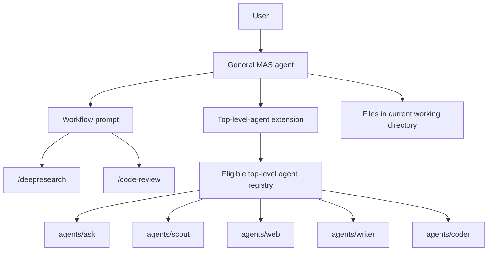

# Top-Level Agent MAS

This document specifies an experimental multi-agent system style for dot-pi. The goal is to reuse a small, fixed set of cleaned-up top-level agents as durable capability agents, then compose them with workflow prompts.

This is both the design document and implementation plan for the experiment. The existing MAS model remains valid and unchanged.

## Summary

The current MAS pattern gives each workflow-oriented agent its own nested worker pool. A deep research agent, for example, can have research-specific workers for scouting, collecting, writing, and editing. That shape is useful for tightly controlled workflows, but it can encourage duplicated worker definitions when several workflows need the same underlying capabilities.

The proposed pattern separates durable capability from workflow:

- Top-level agents represent durable capabilities and trust boundaries.
- Workflow prompts represent task-specific orchestration.
- A new extension invokes a hard-coded set of core top-level agents.
- The existing orchestrator extension remains responsible for the current nested-worker pattern.

In this model, the general `mas` agent can run a `/deepresearch` prompt that asks it to use the `web` top-level agent for search and browser-control work, `writer` for prose artifacts, and `ask` for semantic evaluation or final PASS/FAIL checks. The workflow prompt supplies the research-specific sequencing and artifact expectations. The workers remain general.

## Design Principle

Agents should represent durable capability and trust boundaries. Prompts should represent workflows.

A durable capability is something that remains useful across many workflows:

- Searching live web sources.
- Browsing and extracting page content.
- Writing and editing files.
- Reviewing code.
- Reading repository context.
- Chat-only reasoning, judging, classification, and semantic evaluation.
- Performing OCR or vision-heavy inspection.

A workflow is a task pattern:

- Deep research.
- Documentation writing.
- Code review.
- Feature implementation.
- PDF reading.
- Release-note drafting.

The top-level-agent MAS should avoid creating new worker identities just because a workflow has a phase name. Instead of creating a permanent `collector` worker for one research workflow, the MAS should call `web` with precise instructions for source discovery or browser inspection. Instead of creating a permanent `report-writer` worker for one workflow, it should call `writer` with the report persona for that invocation.

Tool permissions, skills, model choices, context-file behavior, and safety posture must stay structural. They should not be moved into workflow prompts. A prompt can ask a worker to behave like a collector for one task, but it should not grant browser access, filesystem access, or repository context access.

## Relationship To Existing MAS

The existing MAS design should remain intact. It is optimized for agents that own their worker pool and invoke nested worker config roots. That pattern is still appropriate when a workflow needs stable, workflow-specific workers with strict contracts.

The top-level-agent MAS is a separate experiment:

- It uses a separate extension.
- It discovers a different class of worker.
- It has different compatibility rules.
- It should not alter existing nested-worker discovery.
- It should not require changes to current workflow-specific MAS agents.

This separation keeps the experiment reversible. If the new model proves useful, individual workflows can migrate later. If it does not, existing MAS behavior remains stable.

## Target Architecture



The MAS agent owns the user conversation. The workflow prompt tells the MAS how to decompose the task. The extension exposes the hard-coded core top-level agents as callable workers. Worker agents run in isolated child contexts, inherit the MAS process working directory, and receive specific task instructions from the MAS.

## First-Version Core Workers

The first version should include only the hard-coded core top-level agents:

| Agent | Structural Capability | Expected Worker Uses |
|-------|-----------------------|----------------------|
| `ask` | No tools. Chat-only reasoning. | Q/A, semantic evaluation, classification, critique, PASS/FAIL judging. |
| `scout` | `ls`, `find`, `grep`, `read`. | Read-only repo or directory exploration, codebase summaries, locating relevant files. |
| `writer` | `ls`, `find`, `grep`, `read`, `write`, `edit`. | Documentation, prose editing, report drafting, artifact cleanup. |
| `coder` | `ls`, `find`, `grep`, `read`, `write`, `edit`, `bash`. | Code changes, tests, command execution, build/debug loops. |
| `web` | `ls`, `find`, `grep`, `read`, `bash` plus web/browser skills. | Web search, source extraction, browser-control, screenshots, citation-backed synthesis. |

These are the only workers the experimental `mas` agent should expose at first. Workflow-specific agents such as `reader` and `deepresearch` should not be exposed as workers; their reusable behavior should migrate into prompt templates on `mas`, such as `/deepresearch`.

## New Extension

The experiment should use a new extension, tentatively:

```text
shared/extensions/top-level-agent-orchestrator/
```

The new extension should not be a mode inside the existing orchestrator extension. It can borrow implementation ideas, but it should own its own discovery rules, tool schema, prompt augmentation, filtering, and worker-selection rules.

Reasons to use a separate extension:

- It keeps existing MAS behavior stable.
- It avoids overloading one implementation with two different meanings of "available agent."
- It lets the new model evolve independently.
- It makes the experiment easy to attach only to a future general MAS agent.
- It keeps the first-version worker set intentionally small.

The tool name for the new extension should be `subagent`. Reusing the name is acceptable because the general `mas` agent should load only the new top-level-agent extension, while existing workflow-specific MAS agents continue to load the existing nested-worker orchestrator. The two extensions should not be loaded into the same agent config in the first version because they would register the same tool name with different worker catalogs.

The top-level `subagent` tool invokes top-level capability agents, not nested workflow workers. Its first-version contract should support `agent`, optional `persona`, and `task` for single calls, plus equivalent `tasks[]` and `chain[]` item shapes for parallel and sequential calls.

## Discovery Model

The extension should discover top-level agent config roots under:

```text
agents/
```

Discovery should be explicit and conservative. The extension should not blindly expose every top-level agent. The first implementation should use a hard-coded worker list in `shared/extensions/top-level-agent-orchestrator/` containing exactly:

```json
{
  "agents": ["ask", "scout", "writer", "coder", "web"]
}
```

Only those agents should appear in the MAS catalog. This avoids accidental recursion, prevents partially cleaned-up agents from being invoked as workers, and keeps the experiment focused on a small set of durable capability boundaries.

Because the list is hard-coded, the first version does not need a general-purpose compatibility scanner. It should not walk every directory under `agents/`, parse arbitrary bootstrap files, detect workspace agents, or infer whether an agent is an orchestrator. The core list is expected to be curated and kept compatible by implementation work in this repo.

The extension should resolve each hard-coded name relative to the dot-pi root, read that agent's `CAPABILITY.md`, and build the prompt catalog from the descriptors that exist. Missing descriptors should not produce strict startup failure during the experiment, but the implementation plan requires adding descriptors for all five core agents before meaningful smoke testing.

`coder` is allowed to rely on pi's default system prompt instead of a local `SYSTEM.md`. A missing local `SYSTEM.md` should not by itself make a hard-coded core worker ineligible.

## Workspace Agent Exclusion

Workspace agents should be excluded from the first version by curation rather than by broad runtime scanning. This is a worker-selection rule, not a requirement that users adopt dot-pi workspace agents for `mas`.

The user chooses the execution directory by launching `mas` from an existing project or by creating and entering a clean directory before launch. The MAS and its workers operate in that current working directory. Workflow prompts may ask workers to create local directories such as `sources/`, `drafts/`, or `reports/`, but the top-level-agent MAS should not depend on the dot-pi workspace-agent lifecycle.

Top-level agents normally launch through the dot-pi dispatcher. The dispatcher handles optional workspace selection, workspace creation, bootstrap sourcing, runtime environment setup, and resume behavior.

A worker invocation from a MAS extension starts a child agent process directly. It does not run the target agent through the dispatcher. That means a workspace agent's launch lifecycle is not available to the child process.

The hard-coded v1 worker list should contain only agents that do not require workspace-agent bootstrap behavior. The extension does not need to parse all candidate agents for:

```sh
WORKSPACE_AGENT=1
```

Later versions could define a way to delegate through the dispatcher, emulate the workspace lifecycle, or enforce compatibility checks dynamically, but that should not be part of the first implementation.

## Capability Descriptors

Top-level agents need a parent-facing contract. The existing human-facing launcher docs are not part of this design.

The proposed descriptor file is:

```text
CAPABILITY.md
```

Each hard-coded core top-level agent should include this file. The new extension should use it to build the MAS catalog appended to the parent prompt.

The descriptor should be concise and operational. Suggested sections:

```markdown
# web

## Capability
Find, inspect, and synthesize live web sources using configured search and browser-control skills.

## Use When
- A workflow needs fresh web source discovery.
- The MAS needs URLs, titles, relevance notes, source summaries, screenshots, or targeted page extraction.

## Inputs
- A focused research question.
- Optional constraints such as date range, source type, or number of sources.

## Outputs
- Concise findings.
- Source URLs and relevance notes.
- Gaps, uncertainty, and follow-up queries.

## Artifact Behavior
- Does not create files unless explicitly instructed and structurally allowed.

## Safety And Limits
- Cite URLs.
- Stop and report provider failures instead of retrying indefinitely.
```

The descriptor is not a replacement for the agent's system prompt. The system prompt defines the worker's behavior. The descriptor tells the MAS when and how to invoke that worker.

First-version descriptors should be plain Markdown without required structured frontmatter. If structured descriptor data becomes useful later, it can be added deliberately after the Markdown contract is proven.

Implementation should add these files before smoke testing the new extension:

```text
agents/ask/CAPABILITY.md
agents/scout/CAPABILITY.md
agents/writer/CAPABILITY.md
agents/coder/CAPABILITY.md
agents/web/CAPABILITY.md
```

Each descriptor should describe direct worker behavior, not launcher usage. Human-facing files such as `README.md`, `USAGE.md`, and `banner.txt` should not be parsed to build the MAS catalog.

## Workflow Prompts

Workflow prompts should live on the future MAS agent. They supply task-specific orchestration policy without creating new permanent worker identities.

A workflow prompt should specify:

- The workflow goal.
- Recommended worker capabilities.
- Sequencing and parallelism.
- Artifact paths.
- Quality gates.
- Stop conditions.
- Final response expectations.
- Invocation personas, including the fact that worker replies are consumed by the orchestrator and should not be written as human-facing responses.

The final response expectation belongs to the MAS agent, not to every worker. For artifact-producing workflows, the best final response is often a short status and path, such as `Research completed. Report saved to ./report.md`. The MAS should not duplicate the artifact by summarizing it back to the user unless the workflow explicitly asks for a summary.

For example, a future `/deepresearch` prompt might specify:

```markdown
# Deep Research Workflow

Use top-level capability agents.

1. Ask `web` to find source candidates for the user's topic.
2. Ask `web` to inspect selected URLs and save source notes when an artifact is needed.
3. Ask `writer` to synthesize the saved notes into `report.md`.
4. Ask `ask` with the `judge` persona to check source coverage and factual consistency.
5. If the quality gate passes, reply to the user with a concise completion notice such as: `Research completed. Report saved to ./report.md`.
```

The workers do not become deep-research-specific. They receive deep-research-specific task instructions only for that invocation.

## Invocation Semantics

The new extension should support at least three invocation shapes:

- Single worker call.
- Parallel independent worker calls.
- Sequential chain where later calls can reference earlier output.

The MAS should pass explicit task instructions to each worker. Instructions should include:

- The user's goal.
- The selected invocation persona, if any.
- The worker's role in this invocation.
- Any files it may read or write.
- Expected orchestrator-facing output format.
- Failure conditions.
- Whether the answer should be concise status, operational notes, or artifact-oriented.

The worker process should inherit the MAS current working directory and the runtime environment needed by the target agent, including web/browser environment variables such as `$B` when calling `web`. The extension should set `PI_IS_SUBAGENT=1` for every worker invocation.

The launch path should mirror the existing nested-worker orchestrator where possible: spawn a child `pi` process in JSON mode, set `PI_CODING_AGENT_DIR` to the selected top-level agent root, read that agent's `pi-args`, pass `--persona <name>` when a persona is selected, pass an explicit worker trace `--session-dir`, and send the delegated task through print mode. The extension should not invoke the dot-pi dispatcher for workers in the first version.

Worker replies are not human-facing. A worker is part of a chain, and its final reply is consumed by the orchestrator. Worker instructions should explicitly say that the worker should not summarize for the user, explain its process conversationally, or add human-centered preamble and closing text. The final reply should carry only the information the orchestrator needs to decide the next step.

Worker output can be natural language. It does not need to follow a strict schema because the top-level orchestrator is another agent and can interpret concise operational replies. The important invariant is content, not format: the reply should tell the orchestrator what happened, what artifacts were created or changed, what decisions matter, and whether anything blocked or failed.

The extension should capture enough process metadata for debugging and orchestration, but the worker's own final reply can remain plain text:

- Agent name.
- Exit status.
- Final orchestrator-facing reply.
- Tool or runtime errors when available.
- Usage statistics when available.

Artifact paths do not need a separate machine-readable channel in the first version. Workers should mention important paths directly in their final reply.

## Session Trace Management

Top-level `mas` session files and worker trace files have different jobs and should be stored separately.

The top-level `mas` agent's own JSONL sessions should remain in its normal `sessions/` directory so user-initiated conversations can be resumed normally. A worker invocation of `ask`, `scout`, `writer`, `coder`, or `web` is not a user-resumable conversation. Those child JSONL files are retrospective execution traces for the MAS trajectory, and they should not be written into the selected worker agent's config-root `sessions/` directory.

For every top-level MAS run, the extension should create or select a dedicated trace bundle directory for all worker sessions from that run. For in-situ `mas`, the first-version convention should be:

```text
agents/mas/subagent-traces/<mas-run-id>/
```

The sibling `agents/mas/sessions/` directory remains reserved for user-resumable `mas` conversations:

```text
agents/mas/sessions/          # top-level user-resumable MAS sessions
agents/mas/subagent-traces/   # grouped worker JSONL traces
```

For workspace MAS runs in a later version, the same layout can move under the workspace:

```text
<workspace>/sessions/              # top-level user-resumable MAS sessions
<workspace>/subagent-traces/<run>/ # grouped worker JSONL traces
```

The extension should derive one `mas-run-id` at the start of a MAS process and reuse it for every worker launch in that top-level run. If pi exposes a parent session identifier, the run id should include or mirror it. Otherwise, a timestamp plus short random suffix is sufficient, such as:

```text
2026-05-06-203104--mas-a7f3c2
```

Every worker process should be launched with an explicit session policy:

- In normal tracing mode, pass `--session-dir <trace-bundle-dir>`.
- If a future workflow intentionally disables trace persistence, pass `--no-session`.
- Never allow child workers to fall back to `agents/<worker>/sessions/`.

The trace bundle should include a small manifest for retrospective analysis:

```json
{
  "parentAgent": "mas",
  "traceRunId": "2026-05-06-203104--mas-a7f3c2",
  "cwd": "/path/to/project",
  "workers": [
    {
      "index": 1,
      "agent": "web",
      "persona": null,
      "mode": "single",
      "startedAt": "2026-05-06T20:31:04-07:00",
      "exitCode": 0
    }
  ]
}
```

The manifest does not need to replace pi's JSONL session files. It only needs to make a complete MAS trajectory easy to find and inspect.

The tool schema should support these first-version shapes:

```json
{
  "agent": "ask",
  "persona": "judge",
  "task": "Check whether report.md satisfies the citation rules."
}
```

```json
{
  "tasks": [
    {
      "agent": "web",
      "task": "Find five authoritative sources for the topic."
    },
    {
      "agent": "scout",
      "task": "Locate existing notes or docs relevant to the topic."
    }
  ]
}
```

```json
{
  "chain": [
    {
      "agent": "web",
      "task": "Find source candidates for the topic."
    },
    {
      "agent": "ask",
      "persona": "judge",
      "task": "Evaluate whether these source candidates are sufficient: {previous}"
    }
  ]
}
```

`persona` is optional. When present, the extension should launch the worker with `--persona <name>`.

## Invocation Personas

Invocation personas combine the ideas previously described as personas, semantics, and contracts. A persona is a named, auditable system-prompt overlay for a worker invocation. It can control voice and stance, but its more important job is to define worker behavior for one reusable invocation pattern.

A persona is not a new subagent identity. It is an invocation-time behavior layer applied to a durable capability agent. The task supplies the concrete work item. The base agent config supplies structural capability, tool access, skills, context-file behavior, model defaults, and safety boundaries.

Personas live under the worker config root:

```text
agents/ask/personas/judge.md
agents/ask/personas/classifier.md
```

The first version only needs `ask` personas. Future workflows can add personas to `web`, `writer`, `coder`, or other core agents when repeated invocation patterns justify them. A persona file is a system-prompt overlay with frontmatter:

```markdown
---
description: PASS/FAIL evaluator for orchestrator quality gates
mode: replace
---

You are evaluating an artifact for the orchestrator, not speaking to the user.
Check the requested criteria and reply only with PASS or FAIL plus one concise reason.
```

The `mode` field controls prompt composition:

- `append`: preserve the base system prompt and append the persona block.
- `prepend`: put the persona block before the base system prompt.
- `replace`: replace the base system prompt entirely.

The default should be `append`, because capability agents often have safety, tool, or task instructions in their base prompt that must remain active. `replace` is appropriate for tiny chat-only agents such as `ask`, where the static prompt exists mainly to prevent pi from injecting its default system prompt.

The personas implementation already supports two activation paths:

- `/persona <name>` for interactive top-level use.
- `--persona <name>` for subprocess and MAS use.

A persona should answer the operational questions the orchestrator would otherwise have to repeat in every task:

- What role is this worker playing in this call?
- What method should it use to accomplish the task?
- What files, paths, URLs, or prior artifacts should it inspect?
- What files, paths, URLs, or unrelated context should it ignore?
- What artifacts may it create or modify?
- What counts as success, failure, or a blocker?
- What should it do if it encounters uncertainty, missing inputs, tool failure, or partial results?
- What should the final reply tell the orchestrator?
- What human-facing explanation or summary is forbidden?

The MAS should invoke a persona by name, not by passing its full text. For example:

```json
{
  "agent": "ask",
  "persona": "judge",
  "task": "Check whether report.md satisfies the citation rules."
}
```

This keeps orchestration prompts short while preserving traceability. The selected persona remains auditable in the worker's config directory, and the MAS only decides which persona is appropriate for the invocation.

Personas are not capabilities. They must not be used to grant tools, browser access, repository context, filesystem permissions, model defaults, or skills that are not already structurally allowed by the worker config. If persona frontmatter can alter tools or skills in a future implementation, that behavior must be explicit and treated as part of the worker's structural configuration.

Personas should usually say that the worker is not speaking to the user. The persona should define what the orchestrator needs back: status, artifact paths, key decisions, validation results, errors, and next-step recommendations. A worker that created or inspected a large artifact should normally return the artifact path and concise operational notes, not a prose summary of the artifact.

For a deep research workflow, `/deepresearch` might invoke `ask` with the `judge` persona:

```markdown
Use `ask` with persona `judge`.
Task: Check whether `report.md` satisfies the citation rules.
Criteria: source coverage, citation format, and unsupported claims.
Reply to the orchestrator only. Return `PASS` or `FAIL: <one sentence>`.
Do not add preamble, follow-up, user-facing explanation, or a report summary.
```

Personas should stay small, roughly 10-60 lines. If a persona grows into a full worker prompt, that is a signal to either simplify it, move the stable behavior into the agent's base prompt, or reconsider whether the workflow really needs a specialized subagent.

The existing `personas` extension is the first-version implementation path. The top-level-agent MAS should use `persona` terminology consistently and should pass persona names through to child processes with `--persona`.

## Artifact Handoffs

The MAS root owns the current working directory as the shared artifact area. Workers may contribute artifacts only when their structural permissions allow it and the task explicitly asks for it.

Large handoffs should use files instead of long return text. This keeps the parent context small and makes failures inspectable.

Recommended conventions:

- `sources/` for source captures and notes.
- `drafts/` for intermediate writing.
- `reports/` or a named root file for final deliverables.
- `screenshots/` for browser evidence.
- `subagent-traces/` for grouped worker JSONL traces managed by the MAS extension.

The exact artifact directories should be chosen by each workflow prompt. Worker agents should not assume workflow-specific directories unless the invocation gives them. Session trace directories are different from workflow artifacts and should be managed by the MAS extension, not by individual workflow prompts.

## Subprocess-Aware Extensions

The new top-level-agent extension should preserve the existing subprocess convention used by nested-agent orchestration:

```text
PI_IS_SUBAGENT=1
```

Any extension that launches a child agent should set this environment variable for the child process. Any extension that provides interactive or parent-only behavior should check it before registering tools, commands, hooks, prompt augmentation, or UI affordances that do not make sense in a worker process.

This is especially important for tools that require live user input. A worker agent cannot pause and ask the user to choose from an interactive prompt because the parent MAS owns the user conversation. The child process usually runs with piped IO and returns an orchestrator-facing reply to the parent.

The `questionnaire` tool is the motivating example. It is useful in an interactive top-level `writer` or `coder` session, and direct-use agents may include `questionnaire` in their `pi-args` `--tools` allowlist. The same tool should not be available when those agents are invoked as workers. The best first-version behavior is registration-time suppression in the extension:

```ts
export default function questionnaire(pi: ExtensionAPI) {
	if (process.env.PI_IS_SUBAGENT === "1") return;

	pi.registerTool({
		name: "questionnaire",
		// ...
	});
}
```

Execution-time checks such as `ctx.hasUI` are still useful as a fallback, but they are not sufficient by themselves. If the tool is registered, the model may still see it and waste a turn trying to call it. Registration-time suppression is the cleaner behavior for subprocesses.

This allows one top-level agent config to serve both direct interactive use and MAS worker use:

- Direct `writer` or `coder`: `questionnaire` may be listed in `--tools`, registered by the extension, and visible to the model.
- Worker `writer` or `coder`: the top-level-agent orchestrator sets `PI_IS_SUBAGENT=1`; the extension does not register `questionnaire`; the model cannot see or call it even if the direct-use `pi-args` allowlist contains the name.
- Prompts for `writer` and `coder` should phrase questionnaire use as direct-interactive behavior only. In worker mode they should complete the delegated task or return a concise blocker instead of trying to ask the user.

This convention applies beyond questionnaires:

- UI-only commands should skip registration or no-op when invoked as a worker.
- Tools that request approval, confirmation, or free-form user input should not be exposed to worker agents.
- Prompt augmentation meant for an interactive parent should not be injected into child agents.
- Status widgets, notifications, speech, and other user-facing affordances should check both `PI_IS_SUBAGENT` and UI availability.
- Extensions that are safe in subprocesses should document that assumption.

Agent prompts should also account for this distinction. A direct-use top-level agent may ask clarifying questions, but the same agent invoked as a worker should complete the delegated task or return a concise blocker. If a prompt tells an agent to use an interactive tool at the start of every task, that prompt must be revised before the agent is used as a worker.

## Structural Boundaries

The top-level-agent MAS must preserve structural boundaries:

- `ask` should not gain read access because a prompt asks it to inspect files.
- `scout` should not gain write access because a prompt asks it to save notes.
- `writer` should not browse the web unless its config already permits it.
- A coding agent may load repository context when that is its intended role.
- A non-coding research agent may disable repository context to avoid instruction leakage.
- `web` should keep search, browser, citation, and external-side-effect safety rules in its own prompt and skills.

Workflow prompts can narrow behavior but should not be trusted to create security boundaries.

## Prompt Augmentation

At startup, the new extension should append a catalog of the hard-coded core top-level agents to the MAS system prompt. The catalog should be built from capability descriptors, not from human-facing launch documentation.

The catalog should include:

- Callable name.
- Capability summary.
- When to use the agent.
- Input expectations.
- Output expectations.
- Safety and artifact notes.

The catalog should omit:

- Agents outside the hard-coded core list.
- Agents whose capability descriptor cannot be read.

The extension should also provide a command to inspect the active catalog interactively.

## Recursion Prevention

The first implementation should avoid recursive orchestration.

The hard-coded core list is the first recursion-prevention mechanism. Since `mas`, `reader`, `deepresearch`, and other workflow-oriented agents are not in the list, the extension does not need to discover and exclude them dynamically.

The first implementation should also avoid loading the new top-level-agent extension and the existing nested-worker orchestrator extension into the same top-level agent config. Both expose the `subagent` tool name, but with different worker catalogs.

Recursive orchestration may be useful later, but it requires budgets, depth limits, failure propagation, and clear tracing. It should not be part of the first experiment.

## Top-Level Agent Cleanup Requirements

Before implementation, the five core top-level agents should be tidied so they behave predictably as workers.

Each core agent should have:

- A clear system prompt, or an intentional reliance on pi's default system prompt in the case of `coder`.
- A clear capability descriptor.
- Intentional tool permissions.
- Intentional skill links.
- A model default appropriate to its role.
- Clear context-file behavior.
- No workspace requirement.
- No assumptions that it is always speaking directly to a human.
- Subprocess-safe extensions that suppress interactive tools and UI-only behavior when `PI_IS_SUBAGENT=1`.

Direct-user friendliness is still useful, but worker use requires stricter invocation personas and orchestrator-facing replies.

## Compatibility Risks

The main risks are:

- A direct-use top-level agent may ask clarifying questions when a worker should return a bounded result.
- A writing or coding agent may make edits when the MAS expected analysis only.
- `web` may return a narrative answer when the workflow needs a parseable source list.
- `web` may depend on dispatcher-provided browser environment that must be inherited by the child process.
- A worker may load repo context files that are unrelated to the MAS current working directory.
- The MAS may select an overpowered worker when a safer limited worker exists.
- A direct-use `questionnaire` instruction may leak into worker behavior unless the prompt and extension both account for subprocess mode.

The design answers these risks with a hard-coded core worker list, capability descriptors, curated worker setup, structural tool boundaries, and explicit workflow prompts.

## Implementation Plan

1. Update this specification until the first-version worker set and safety rules are stable.
2. Add `CAPABILITY.md` to `ask`, `scout`, `writer`, `coder`, and `web`.
3. Keep `persona` as the invocation overlay concept. The first version only needs the existing `ask` personas such as `judge` and `classifier`; add personas to other workers only when a future workflow requires them.
4. Clean the five core agents for worker use: prompts, `pi-args`, skills, model defaults, context-file behavior, and subprocess-safe extensions. Leave `coder`'s current context-file behavior as-is for the first version.
5. Ensure `web` includes browser-control behavior and any required skill link or environment inheritance needed for `$B`.
6. Make direct-use interactive tools such as `questionnaire` available to `writer` and `coder` only when not running with `PI_IS_SUBAGENT=1`.
7. Implement `shared/extensions/top-level-agent-orchestrator/` separately from the existing nested-worker orchestrator. It should register the `subagent` tool, use the hard-coded core worker list, support `agent`, optional `persona`, and `task`, pass personas to child processes with `--persona`, and pass an explicit worker trace `--session-dir`.
8. Configure `agents/mas/` with the new extension and a clear `SYSTEM.md`.
9. Add workflow prompts to `agents/mas/prompts/`, starting with `/deepresearch`.
10. Run smoke tests with each single worker: `ask`, `scout`, `writer`, `coder`, and `web`.
11. Run small multi-worker workflows and inspect final artifacts, intermediate files, and worker outputs.
12. Decide whether existing workflow-specific MAS agents should remain, be deprecated, or be reduced to `mas` prompt templates.

Smoke-test acceptance criteria:

- The `mas` system prompt catalog includes the five hard-coded workers and content from their `CAPABILITY.md` files.
- A single `subagent` call works with `agent` and `task`.
- A single `subagent` call works with `agent`, `persona`, and `task`, including `ask` with `persona: "judge"`.
- Parallel `tasks[]` calls return independent worker results.
- Sequential `chain[]` calls can reference prior output with `{previous}`.
- Child workers inherit the parent working directory and relevant runtime environment.
- Every child worker runs with `PI_IS_SUBAGENT=1`.
- Every child worker receives an explicit `--session-dir` under the current MAS run's trace bundle, and no worker JSONL files are written to `agents/<worker>/sessions/`.
- The current MAS run's trace bundle contains a manifest that lists worker invocations and enough metadata to inspect the full trajectory later.
- `questionnaire` is not registered or visible inside worker processes.
- `web` can use configured web search and browser-control behavior, or returns a concise blocker when required provider or browser state is unavailable.
- Worker results expose final reply, exit status, runtime/tool errors when available, and usage statistics when available.
- Artifact-producing workers write only when structurally allowed and explicitly instructed, then mention important paths in their final reply.

## Non-Goals

- Do not replace the existing MAS model.
- Do not modify nested-worker discovery for existing MAS agents.
- Do not add workspace top-level agents to the hard-coded worker list in the first version.
- Do not treat prompt instructions as a substitute for tool restrictions.
- Do not auto-expose every top-level agent.
- Do not expose workflow-specific top-level agents such as `reader` or `deepresearch` as workers.
- Do not migrate existing workflows before the five core top-level agents are cleaned up.

## Open Design Questions

- Should the extension support per-worker timeout and budget controls?
- Which existing workflow-specific MAS agent should be the first candidate for reduction into `mas` prompt templates after the experiment works?
- What additional personas, if any, are justified by future workflows beyond the initial `ask` personas?
