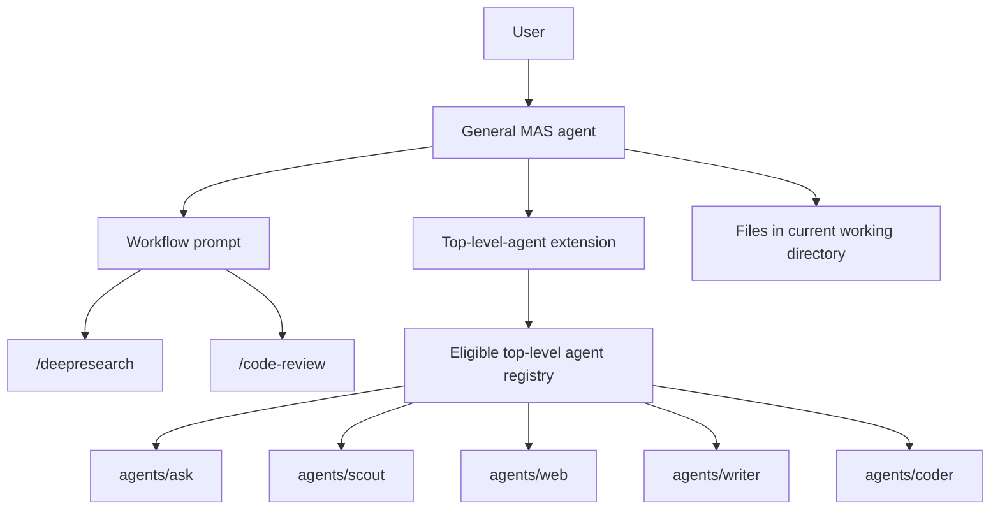

# Top-Level Agent MAS

This document specifies an experimental multi-agent system style for dot-pi. The goal is to reuse a small, fixed set of cleaned-up top-level agents as durable capability agents, then compose them with workflow prompts.

This is both the design document and implementation plan for the experiment. The existing MAS model remains valid and unchanged.

## Summary

The current MAS pattern gives each workflow-oriented agent its own nested worker pool. A deep research agent, for example, can have research-specific workers for scouting, collecting, writing, and editing. That shape is useful for tightly controlled workflows, but it can encourage duplicated worker definitions when several workflows need the same underlying capabilities.

The proposed pattern separates durable capability from workflow:

- Top-level agents represent durable capabilities and trust boundaries.
- Workflow prompts represent task-specific orchestration.
- A new extension discovers and invokes eligible top-level agents.
- The existing orchestrator extension remains responsible for the current nested-worker pattern.

In this model, the general `mas` agent can run a `/deepresearch` prompt that asks it to use the `web` top-level agent for search and browser-control work, `writer` for prose artifacts, and `ask` for semantic evaluation or final PASS/FAIL checks. The workflow prompt supplies the research-specific sequencing and artifact expectations. The workers remain general.

## Design Principle

Agents should represent durable capability and trust boundaries. Prompts should represent workflows.

A durable capability is something that remains useful across many workflows:

- Searching live web sources.
- Browsing and extracting page content.
- Writing and editing files.
- Reviewing code.
- Reading repository context.
- Chat-only reasoning, judging, classification, and semantic evaluation.
- Performing OCR or vision-heavy inspection.

A workflow is a task pattern:

- Deep research.
- Documentation writing.
- Code review.
- Feature implementation.
- PDF reading.
- Release-note drafting.

The top-level-agent MAS should avoid creating new worker identities just because a workflow has a phase name. Instead of creating a permanent `collector` worker for one research workflow, the MAS should call `web` with precise instructions for source discovery or browser inspection. Instead of creating a permanent `report-writer` worker for one workflow, it should call `writer` with the report contract for that invocation.

Tool permissions, skills, model choices, context-file behavior, and safety posture must stay structural. They should not be moved into workflow prompts. A prompt can ask a worker to behave like a collector for one task, but it should not grant browser access, filesystem access, or repository context access.

## Relationship To Existing MAS

The existing MAS design should remain intact. It is optimized for agents that own their worker pool and invoke nested worker config roots. That pattern is still appropriate when a workflow needs stable, workflow-specific workers with strict contracts.

The top-level-agent MAS is a separate experiment:

- It uses a separate extension.
- It discovers a different class of worker.
- It has different compatibility rules.
- It should not alter existing nested-worker discovery.
- It should not require changes to current workflow-specific MAS agents.

This separation keeps the experiment reversible. If the new model proves useful, individual workflows can migrate later. If it does not, existing MAS behavior remains stable.

## Target Architecture



The MAS agent owns the user conversation. The workflow prompt tells the MAS how to decompose the task. The extension exposes eligible top-level agents as callable workers. Worker agents run in isolated child contexts, inherit the MAS process working directory, and receive specific task instructions from the MAS.

## First-Version Core Workers

The first version should include only the hard-coded core top-level agents:

| Agent | Structural Capability | Expected Worker Uses |
|-------|-----------------------|----------------------|
| `ask` | No tools. Chat-only reasoning. | Q/A, semantic evaluation, classification, critique, PASS/FAIL judging. |
| `scout` | `ls`, `find`, `grep`, `read`. | Read-only repo or directory exploration, codebase summaries, locating relevant files. |
| `writer` | `ls`, `find`, `grep`, `read`, `write`, `edit`. | Documentation, prose editing, report drafting, artifact cleanup. |
| `coder` | `ls`, `find`, `grep`, `read`, `write`, `edit`, `bash`. | Code changes, tests, command execution, build/debug loops. |
| `web` | `ls`, `find`, `grep`, `read`, `bash` plus web/browser skills. | Web search, source extraction, browser-control, screenshots, citation-backed synthesis. |

These are the only workers the experimental `mas` agent should expose at first. Workflow-specific agents such as `reader` and `deepresearch` should not be exposed as workers; their reusable behavior should migrate into prompt templates on `mas`, such as `/deepresearch`.

## New Extension

The experiment should use a new extension, tentatively:

```text
shared/extensions/top-level-agent-orchestrator/
```

The new extension should not be a mode inside the existing orchestrator extension. It can borrow implementation ideas, but it should own its own discovery rules, tool schema, prompt augmentation, filtering, and compatibility checks.

Reasons to use a separate extension:

- It keeps existing MAS behavior stable.
- It avoids overloading one tool with two different meanings of "available agent."
- It lets the new model evolve independently.
- It makes the experiment easy to attach only to a future general MAS agent.
- It allows stricter eligibility checks for top-level agents.

The tool name should be distinct from the current nested-worker tool. A possible name is `agent`, `delegate`, or `top_agent`. The exact name should be chosen when implementation starts, but it should make clear that it invokes top-level capability agents, not nested workflow workers.

## Discovery Model

The extension should discover top-level agent config roots under:

```text
agents/
```

Discovery should be explicit and conservative. The extension should not blindly expose every top-level agent. The first implementation should use a hard-coded or MAS-local allowlist containing exactly:

```json
{
  "agents": ["ask", "scout", "writer", "coder", "web"]
}
```

Only those agents should appear in the MAS catalog. This avoids accidental recursion, prevents partially cleaned-up agents from being invoked as workers, and keeps the experiment focused on a small set of durable capability boundaries.

The extension should exclude:

- The active MAS agent itself.
- Any agent marked as a workspace agent.
- Any agent that is itself an orchestration agent, unless explicitly allowed for a later advanced use case.
- Any agent without a capability descriptor.
- Any agent whose config is missing a system prompt.

Name collisions should be resolved before runtime. If two eligible agents expose the same callable name, startup should fail or the duplicate should be omitted with a clear diagnostic.

## Workspace Agent Exclusion

Workspace agents should be excluded from the first version. This is a worker-eligibility rule, not a requirement that users adopt dot-pi workspace agents for `mas`.

The user chooses the execution directory by launching `mas` from an existing project or by creating and entering a clean directory before launch. The MAS and its workers operate in that current working directory. Workflow prompts may ask workers to create local directories such as `sources/`, `drafts/`, or `reports/`, but the top-level-agent MAS should not depend on the dot-pi workspace-agent lifecycle.

Top-level agents normally launch through the dot-pi dispatcher. The dispatcher handles optional workspace selection, workspace creation, bootstrap sourcing, runtime environment setup, and resume behavior.

A worker invocation from a MAS extension starts a child agent process directly. It does not run the target agent through the dispatcher. That means a workspace agent's launch lifecycle is not available to the child process.

An agent should be considered incompatible when its bootstrap declares workspace mode:

```sh
WORKSPACE_AGENT=1
```

Later versions could define a way to delegate through the dispatcher or emulate the workspace lifecycle, but that should not be part of the first implementation.

## Capability Descriptors

Top-level agents need a parent-facing contract. The existing human-facing launcher docs are not part of this design.

The proposed descriptor file is:

```text
CAPABILITY.md
```

An eligible top-level agent should include this file. The new extension should use it to build the MAS catalog appended to the parent prompt.

The descriptor should be concise and operational. Suggested sections:

```markdown
# web

## Capability
Find, inspect, and synthesize live web sources using configured search and browser-control skills.

## Use When
- A workflow needs fresh web source discovery.
- The MAS needs URLs, titles, relevance notes, source summaries, screenshots, or targeted page extraction.

## Inputs
- A focused research question.
- Optional constraints such as date range, source type, or number of sources.

## Outputs
- Concise findings.
- Source URLs and relevance notes.
- Gaps, uncertainty, and follow-up queries.

## Artifact Behavior
- Does not create files unless explicitly instructed and structurally allowed.

## Safety And Limits
- Cite URLs.
- Stop and report provider failures instead of retrying indefinitely.
```

The descriptor is not a replacement for the agent's system prompt. The system prompt defines the worker's behavior. The descriptor tells the MAS when and how to invoke that worker.

Implementation should add these files before the new extension treats any agent as eligible:

```text
agents/ask/CAPABILITY.md
agents/scout/CAPABILITY.md
agents/writer/CAPABILITY.md
agents/coder/CAPABILITY.md
agents/web/CAPABILITY.md
```

Each descriptor should describe direct worker behavior, not launcher usage. Human-facing files such as `README.md`, `USAGE.md`, and `banner.txt` should not be parsed to build the MAS catalog.

## Workflow Prompts

Workflow prompts should live on the future MAS agent. They supply task-specific orchestration policy without creating new permanent worker identities.

A workflow prompt should specify:

- The workflow goal.
- Recommended worker capabilities.
- Sequencing and parallelism.
- Artifact paths.
- Quality gates.
- Stop conditions.
- Final response expectations.

For example, a future `/deepresearch` prompt might specify:

```markdown
# Deep Research Workflow

Use top-level capability agents.

1. Ask `web` to find source candidates for the user's topic.
2. Ask `web` to inspect selected URLs and save source notes when an artifact is needed.
3. Ask `writer` to synthesize the saved notes into `report.md`.
4. Ask `ask` with a judge persona or inline judge contract to check source coverage and factual consistency.
5. Read the final artifact and summarize the result to the user.
```

The workers do not become deep-research-specific. They receive deep-research-specific task instructions only for that invocation.

## Invocation Semantics

The new extension should support at least three invocation shapes:

- Single worker call.
- Parallel independent worker calls.
- Sequential chain where later calls can reference earlier output.

The MAS should pass explicit task instructions to each worker. Instructions should include:

- The user's goal.
- The worker's role in this invocation.
- Any files it may read or write.
- Expected output format.
- Failure conditions.
- Whether the answer should be concise or artifact-oriented.

The worker process should inherit the MAS current working directory and the runtime environment needed by the target agent, including web/browser environment variables such as `$B` when calling `web`. The extension should set `PI_IS_SUBAGENT=1` for every worker invocation.

The extension should capture worker output in a structured result that includes:

- Agent name.
- Exit status.
- Final text output.
- Tool or runtime errors when available.
- Usage statistics when available.
- Artifact paths returned by the worker, if any.

## Invocation Personas

Some workers need a reusable voice, stance, or reasoning style without making the MAS pass a long prompt on every invocation. This should be handled with named personas local to the worker agent.

Personas live under the worker config root:

```text
agents/ask/personas/chat.md
agents/ask/personas/plato.md
```

A persona file is a system-prompt overlay with frontmatter:

```markdown
---
description: Direct and sharp; anti-slop, real opinions
mode: replace
---

You are a conversational partner running in chat-only mode...
```

The `mode` field controls prompt composition:

- `append`: preserve the base system prompt and append the persona block.
- `prepend`: put the persona block before the base system prompt.
- `replace`: replace the base system prompt entirely.

If `personas/helpful.md` exists, it is the default persona. Agents that want a neutral baseline should encode that baseline as `helpful` rather than relying on a persona-less or "off" state.

The default should be `append`, because capability agents often have safety, tool, or task instructions in their base prompt that must remain active. `replace` is appropriate for tiny chat-only agents such as `ask`, where the static prompt exists mainly to prevent pi from injecting its default system prompt.

The personas extension should support two activation paths:

- `/persona <name>` for interactive top-level use.
- `--persona <name>` for subprocess and MAS use.

The MAS should invoke a persona by name, not by passing its full text. For example:

```json
{
  "agent": "ask",
  "persona": "chat",
  "task": "Evaluate whether this argument is persuasive: ..."
}
```

This keeps orchestration prompts short while preserving traceability. The selected persona remains auditable in the worker's config directory, and the MAS only decides when a persona is appropriate.

Personas are not capabilities. They should not be used to grant tools, browser access, repository context, or filesystem permissions. If persona frontmatter can alter tools or skills, that behavior must remain explicit and should be treated as part of the worker's structural contract.

## Invocation Contracts (Deferred)

Invocation contracts are a likely future extension of this design, but they should be deferred until the basic top-level-agent MAS model works with direct tasks and workflow prompts.

A contract is a small, reusable invocation protocol for a worker. It is not a new subagent identity. It answers questions such as:

- What role is this worker playing in this call?
- What output shape must it return?
- What files or artifacts should it read or produce?
- What counts as success or failure?
- How concise should the reply be?
- How should errors or uncertainty be reported?

Personas and contracts are different:

- A persona controls voice, stance, and reasoning style.
- A contract controls role, output format, artifact expectations, and failure handling.
- The task supplies the concrete work item.
- The base agent config supplies durable capability, tool access, skills, and safety boundaries.

For example, `ask` can use a persona to sound human or terse, but a contract tells it to act as a judge:

```json
{
  "agent": "ask",
  "persona": "helpful",
  "contract": "pass-fail-judge",
  "task": "Check whether report.md satisfies the citation rules. Reply only PASS or FAIL: <one sentence>."
}
```

For a deep research workflow, inline contracts in the `/deepresearch` prompt may be enough at first:

```markdown
When invoking `ask` as final judge, instruct it:
Return exactly `PASS` or `FAIL: <one sentence>`.
Check source coverage, citation format, and unsupported claims.
Do not add preamble or follow-up.
```

Named contract files should only be introduced when the same protocol repeats across workflows or becomes important enough to test independently. This avoids recreating the old `subagents/` tree under a new name.

If promoted to files, contracts should live with the worker they constrain:

```text
agents/ask/contracts/pass-fail-judge.md
agents/ask/contracts/semantic-evaluator.md
agents/web/contracts/source-leads.md
agents/web/contracts/source-capture.md
agents/writer/contracts/research-report.md
```

Contracts should stay small, roughly 10-40 lines. If a contract grows into a full worker prompt, that is a signal to either simplify it, move the stable behavior into the agent's base prompt, or reconsider whether the workflow really needs a specialized subagent.

Contracts must not grant capabilities. A contract may say "write `report.md`," but a worker without write tools still cannot write. Tool access, skills, context-file behavior, model defaults, and safety posture remain structural properties of the agent config.

The first implementation should prefer inline workflow guidance. Contract files are a second-stage abstraction for repeated strict protocols, especially judges, source-list formats, artifact-capture confirmations, and report-output requirements.

## Artifact Handoffs

The MAS root owns the current working directory as the shared artifact area. Workers may contribute artifacts only when their structural permissions allow it and the task explicitly asks for it.

Large handoffs should use files instead of long return text. This keeps the parent context small and makes failures inspectable.

Recommended conventions:

- `sources/` for source captures and notes.
- `drafts/` for intermediate writing.
- `reports/` or a named root file for final deliverables.
- `screenshots/` for browser evidence.
- `sessions/` for optional run logs when a workflow chooses to create them.

The exact directories should be chosen by each workflow prompt. Worker agents should not assume workflow-specific directories unless the invocation gives them.

## Subprocess-Aware Extensions

The new top-level-agent extension should preserve the existing subprocess convention used by nested-agent orchestration:

```text
PI_IS_SUBAGENT=1
```

Any extension that launches a child agent should set this environment variable for the child process. Any extension that provides interactive or parent-only behavior should check it before registering tools, commands, hooks, prompt augmentation, or UI affordances that do not make sense in a worker process.

This is especially important for tools that require live user input. A worker agent cannot pause and ask the user to choose from an interactive prompt because the parent MAS owns the user conversation. The child process usually runs with piped IO and returns structured output to the parent.

The `questionnaire` tool is the motivating example. It is useful in an interactive top-level `writer` or `coder` session, and direct-use agents may include `questionnaire` in their `pi-args` `--tools` allowlist. The same tool should not be available when those agents are invoked as workers. The best first-version behavior is registration-time suppression in the extension:

```ts
export default function questionnaire(pi: ExtensionAPI) {
	if (process.env.PI_IS_SUBAGENT === "1") return;

	pi.registerTool({
		name: "questionnaire",
		// ...
	});
}
```

Execution-time checks such as `ctx.hasUI` are still useful as a fallback, but they are not sufficient by themselves. If the tool is registered, the model may still see it and waste a turn trying to call it. Registration-time suppression is the cleaner behavior for subprocesses.

This allows one top-level agent config to serve both direct interactive use and MAS worker use:

- Direct `writer` or `coder`: `questionnaire` may be listed in `--tools`, registered by the extension, and visible to the model.
- Worker `writer` or `coder`: the top-level-agent orchestrator sets `PI_IS_SUBAGENT=1`; the extension does not register `questionnaire`; the model cannot see or call it even if the direct-use `pi-args` allowlist contains the name.
- Prompts for `writer` and `coder` should phrase questionnaire use as direct-interactive behavior only. In worker mode they should complete the delegated task or return a concise blocker instead of trying to ask the user.

This convention applies beyond questionnaires:

- UI-only commands should skip registration or no-op when invoked as a worker.
- Tools that request approval, confirmation, or free-form user input should not be exposed to worker agents.
- Prompt augmentation meant for an interactive parent should not be injected into child agents.
- Status widgets, notifications, speech, and other user-facing affordances should check both `PI_IS_SUBAGENT` and UI availability.
- Extensions that are safe in subprocesses should document that assumption.

Agent prompts should also account for this distinction. A direct-use top-level agent may ask clarifying questions, but the same agent invoked as a worker should complete the delegated task or return a concise blocker. If a prompt tells an agent to use an interactive tool at the start of every task, that prompt must be revised before the agent is eligible for worker use.

## Structural Boundaries

The top-level-agent MAS must preserve structural boundaries:

- `ask` should not gain read access because a prompt asks it to inspect files.
- `scout` should not gain write access because a prompt asks it to save notes.
- `writer` should not browse the web unless its config already permits it.
- A coding agent may load repository context when that is its intended role.
- A non-coding research agent may disable repository context to avoid instruction leakage.
- `web` should keep search, browser, citation, and external-side-effect safety rules in its own prompt and skills.

Workflow prompts can narrow behavior but should not be trusted to create security boundaries.

## Prompt Augmentation

At startup, the new extension should append a catalog of eligible top-level agents to the MAS system prompt. The catalog should be built from capability descriptors, not from human-facing launch documentation.

The catalog should include:

- Callable name.
- Capability summary.
- When to use the agent.
- Input expectations.
- Output expectations.
- Safety and artifact notes.

The catalog should omit:

- Agents not in the allowlist.
- Workspace agents.
- Agents missing capability descriptors.
- Agents that fail compatibility checks.

The extension should also provide a command to inspect the active catalog interactively.

## Recursion Prevention

The first implementation should avoid recursive orchestration.

Default exclusions should include:

- The active MAS agent.
- Agents that load the new top-level-agent extension.
- Agents that load the existing nested-worker orchestrator extension.
- Workspace MAS agents.

Recursive orchestration may be useful later, but it requires budgets, depth limits, failure propagation, and clear tracing. It should not be part of the first experiment.

## Top-Level Agent Cleanup Requirements

Before implementation, eligible top-level agents should be tidied so they behave predictably as workers.

Each eligible agent should have:

- A clear system prompt.
- A clear capability descriptor.
- Intentional tool permissions.
- Intentional skill links.
- A model default appropriate to its role.
- Clear context-file behavior.
- No workspace requirement.
- No assumptions that it is always speaking directly to a human.
- Subprocess-safe extensions that suppress interactive tools and UI-only behavior when `PI_IS_SUBAGENT=1`.

Direct-user friendliness is still useful, but worker use requires stricter input and output contracts.

## Compatibility Risks

The main risks are:

- A direct-use top-level agent may ask clarifying questions when a worker should return a bounded result.
- A writing or coding agent may make edits when the MAS expected analysis only.
- `web` may return a narrative answer when the workflow needs a parseable source list.
- `web` may depend on dispatcher-provided browser environment that must be inherited by the child process.
- A worker may load repo context files that are unrelated to the MAS current working directory.
- The MAS may select an overpowered worker when a safer limited worker exists.
- A direct-use `questionnaire` instruction may leak into worker behavior unless the prompt and extension both account for subprocess mode.

The design answers these risks with allowlists, capability descriptors, workspace exclusion, structural tool boundaries, and explicit workflow prompts.

## Implementation Plan

1. Update this specification until the first-version worker set and safety rules are stable.
2. Add `CAPABILITY.md` to `ask`, `scout`, `writer`, `coder`, and `web`.
3. Clean the five core agents for worker use: prompts, `pi-args`, skills, model defaults, context-file behavior, and subprocess-safe extensions.
4. Make direct-use interactive tools such as `questionnaire` available to `writer` and `coder` only when not running with `PI_IS_SUBAGENT=1`.
5. Implement `shared/extensions/top-level-agent-orchestrator/` separately from the existing nested-worker orchestrator.
6. Configure `agents/mas/` with the new extension, an explicit core-agent allowlist, and a clear `SYSTEM.md`.
7. Add workflow prompts to `agents/mas/prompts/`, starting with `/deepresearch`.
8. Run smoke tests with each single worker: `ask`, `scout`, `writer`, `coder`, and `web`.
9. Run small multi-worker workflows and inspect final artifacts, intermediate files, and worker outputs.
10. Decide whether existing workflow-specific MAS agents should remain, be deprecated, or be reduced to `mas` prompt templates.

## Non-Goals

- Do not replace the existing MAS model.
- Do not modify nested-worker discovery for existing MAS agents.
- Do not make workspace top-level agents eligible in the first version.
- Do not treat prompt instructions as a substitute for tool restrictions.
- Do not auto-expose every top-level agent.
- Do not expose workflow-specific top-level agents such as `reader` or `deepresearch` as workers.
- Do not migrate existing workflows before the five core top-level agents are cleaned up.

## Open Design Questions

- What should the final extension and tool names be?
- Should the allowlist live in the MAS root, the extension config, or both?
- Should capability descriptors support structured frontmatter?
- Should the extension support per-worker timeout and budget controls?
- Should worker outputs include machine-readable artifact manifests?
- Should `coder` load repository context files when invoked as a worker, or should context-file behavior differ between direct and subprocess use?
