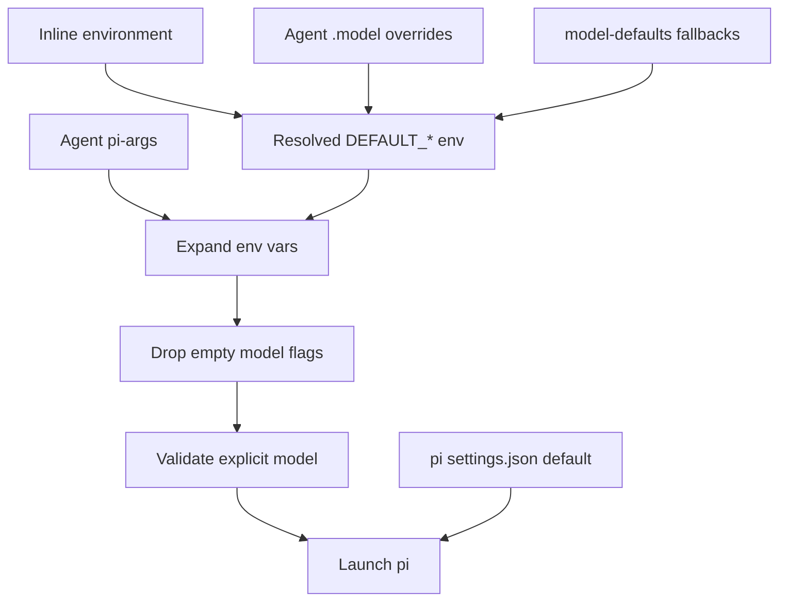

# Model Defaults

dot-pi uses `pi-args` as the canonical place where each agent chooses its model policy. The model default feature gives those `pi-args` files stable aliases, while still allowing local user preferences, inline environment overrides, and pi's own `settings.json` default.

## Files And Commands

### `model-defaults`

Required repo-root local config. It is created from `bootstrap/model-defaults.example` during install or `dotpi sync`, and can be managed with:

```bash
dotpi models
```

`dotpi model-defaults` remains available as a compatibility shortcut for editing only the global aliases.

It defines fallback aliases:

```sh
export DEFAULT_AGENTIC_MODEL="${DEFAULT_AGENTIC_MODEL:-}"
export DEFAULT_FAST_MODEL="${DEFAULT_FAST_MODEL:-}"
export DEFAULT_VLM_MODEL="${DEFAULT_VLM_MODEL:-}"
```

The `${VAR:-...}` form is intentional: inline environment variables keep priority over the file.

`model-defaults` is not sourced by `env.sh`. It is loaded at agent launch time by `dispatch-agent` and, for subagents, by `agent-orchestrator`, after the current agent config root is known. That allows agent-local `.model` files to override repo defaults without masking true inline environment overrides.

### Agent `.model`

Optional agent-local override file, written by the in-agent command:

```text
/model-default
```

Agent `.model` files live in config roots such as `agents/lm/.model`, `agents/deepresearch/.model`, or `subagents/scout/.model`. They contain one raw model id and only affect that specific agent config root. They are gitignored:

```text
lmstudio/nvidia/nemotron-3-super
```

With no arguments, the command opens an interactive menu. If the current agent's `pi-args` contains a model alias such as `$DEFAULT_FAST_MODEL`, the first option writes a direct current-agent model override:

```text
Set current agent model
Set global agentic default
Set global fast default
Set global vision default
Show current defaults
Reset current agent override
```

The direct commands still work:

```text
/model-default agentic
/model-default fast
/model-default vlm
/model-default global agentic
/model-default global fast
/model-default global vlm
/model-default show
/model-default reset
```

### `pi-args`

Each agent or subagent references the alias it wants:

```text
--model
$DEFAULT_FAST_MODEL
--thinking
off
```

If `$DEFAULT_FAST_MODEL` expands to an empty value, `dispatch-agent` drops the `--model` flag before launching pi. That lets pi fall back to its normal `settings.json` default instead of receiving a dangling `--model`.

## Selection Precedence

Model selection resolves in this order:

1. Inline environment overrides:

   ```bash
   DEFAULT_AGENTIC_MODEL=provider/model-name deepresearch
   ```

2. Agent-local `.model` overrides written by `/model-default`.
3. Required repo-root `model-defaults` values written by `dotpi models`.
4. Pi's `settings.json` default, reached when no non-empty model value resolves.

## Target Behavior

- Agent policy lives in `pi-args`, not a separate model policy file.
- `model-defaults` supplies machine-local global fallback aliases.
- Agent `.model` files supply persistent per-agent raw model overrides without editing `pi-args`.
- Inline env overrides are temporary and highest priority among defaults.
- Empty default aliases are valid and result in no `--model` flag being passed.
- Non-empty explicit models are validated against `shared/models.json` before launch. If a `.model` or `model-defaults` value is stale, an interactive launch offers to pick a replacement and then continues.

This makes both of these valid:

```bash
deepresearch
DEFAULT_AGENTIC_MODEL=provider/model-name deepresearch
```

## Typical Agent Policies

Interactive/lightweight agents often use the fast default:

```text
--model
$DEFAULT_FAST_MODEL
```

General coding or orchestration agents usually use the agentic default:

```text
--model
$DEFAULT_AGENTIC_MODEL
```

Vision-heavy subagents use the VLM default:

```text
--model
$DEFAULT_VLM_MODEL
```

## Thinking

Thinking is not part of the model-default alias system. Agents that need a fixed thinking policy should hardcode it in `pi-args`:

```text
--thinking
off
```

Agents that should use pi's provider default should leave `--thinking` out.

## Runtime Flow



## Subagents

Subagents are separate pi config roots, so their own `pi-args` files are read before launch. The `agent-orchestrator` extension applies the same model default behavior for subagents:

- Load the subagent's own `.model` and repo-root `model-defaults`.
- Expand `$DEFAULT_*` in the subagent's `pi-args`.
- Drop empty `--model` values.
- Fail before spawning pi if a resolved explicit model is not in `shared/models.json`.

This keeps parent agents, standalone agents, and subagents on one model selection mechanism.
